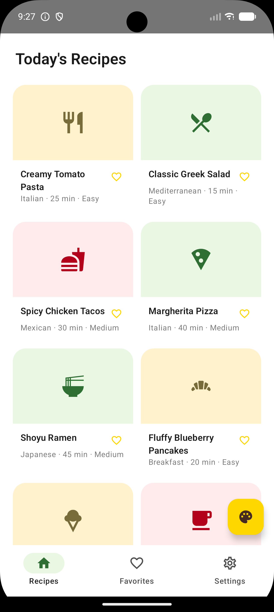
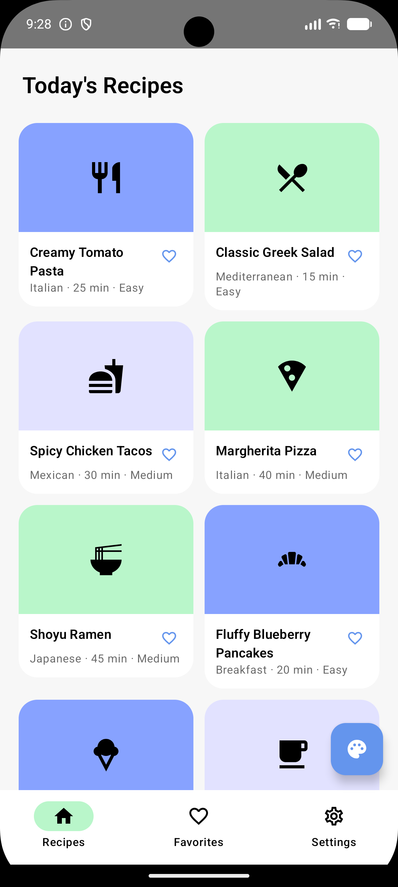
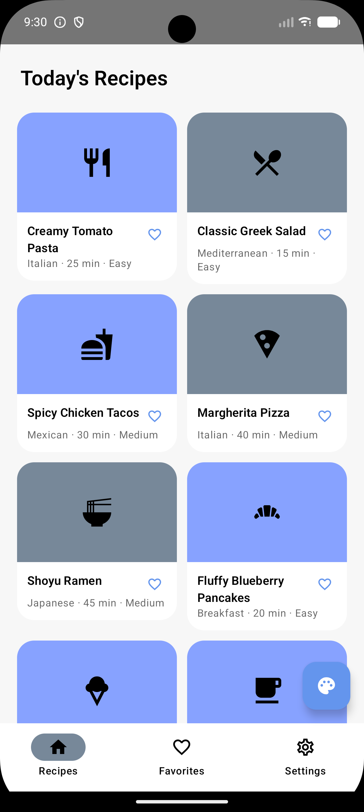

# ColorTouch SDK

**Seminar Project — 10221 Advanced Seminar in Mobile Development**
**Afeka College of Engineering**
**Student:** Hila Hindi

Android library (Kotlin + Jetpack Compose) that fetches a Material3 color
palette for your app, personalized per end user by an LLM acting as a color
psychologist. Bundled with **ColorTouch Recipes**, a demo app exercising
every SDK feature.

📖 **For the backend, full API reference, and system docs, see
[ColorTouch-System](https://github.com/hilahindi/ColorTouch-System).**

---

## Screenshots

Every color below is generated live by the SDK — none are hardcoded. The
in-app questionnaire is themed with the *current* palette too; five
different sets of answers already produce five distinct, coherent themes on
the exact same screen, with no app restart:

<table>
<tr>
<td align="center"></td>
<td align="center"></td>
<td align="center"></td>
<td align="center"></td>
<td align="center"></td>
<td align="center"></td>
</tr>
</table>

**[Full demo video](docs/screenshots/demo.webm)**

---

## Install

```kotlin
// settings.gradle.kts
dependencyResolutionManagement {
    repositories {
        maven("https://jitpack.io")
    }
}
```

```kotlin
// app/build.gradle.kts
dependencies {
    implementation("com.github.hilahindi:ColorTouch-SDK:v0.1.0")
}
```

## Usage

```kotlin
// Once, e.g. in Application.onCreate()
ColorTouchClient.initialize(context = this, baseUrl = "https://your-colortouch-server.example.com/")

// After the end user answers your in-app questionnaire
val result = ColorTouchClient.getPersonalizedPalette(
    developerId = "<your onboarded developer id>",
    userId = userId,
    userAnswers = UserAnswers(userId = userId, responses = responses),
)

// Observe the current palette anywhere in Compose
val currentPalette by ColorTouchClient.currentPalette.collectAsState()
MaterialTheme(
    colorScheme = currentPalette?.colors?.toComposeColorScheme(isSystemInDarkTheme()) ?: lightColorScheme()
) { /* your app */ }
```

See `sample-app/MainActivity.kt` for a complete working example.

---

## Run the Sample App

1. Open this repo in Android Studio and run the `sample-app` configuration.
   It points at `http://10.0.2.2:3000/` by default (the emulator's alias for
   a locally-running [ColorTouch-System](https://github.com/hilahindi/ColorTouch-System)
   server) — a physical device needs your machine's LAN IP instead.
2. Onboard an app via the ColorTouch-System portal's **App Configuration**
   page first — the sample app only *fetches* a base palette.
3. Tap the palette button in the bottom-right corner to open the
   questionnaire and request a live personalization.

---

See [`docs/JITPACK.md`](docs/JITPACK.md) for the release process and
[`docs/CHANGELOG.md`](docs/CHANGELOG.md) for version history.

Part of a seminar project submission for Afeka College of Engineering.
