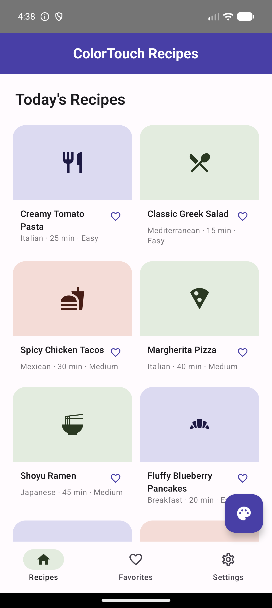
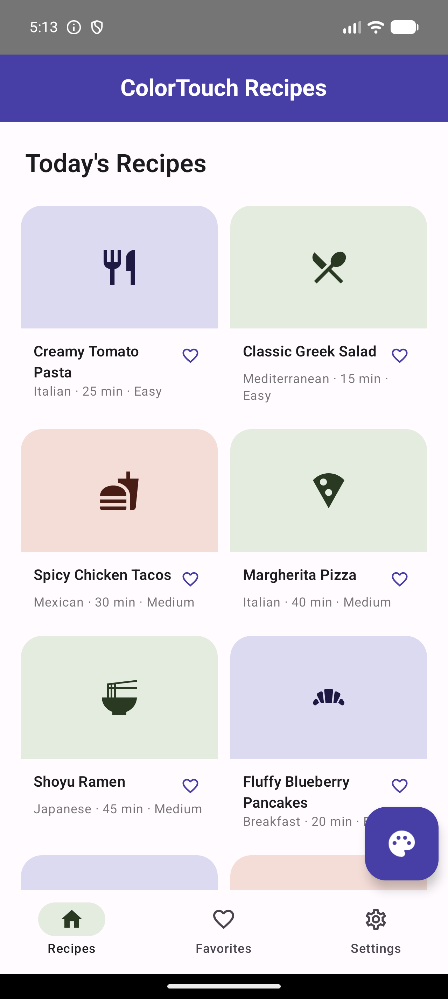
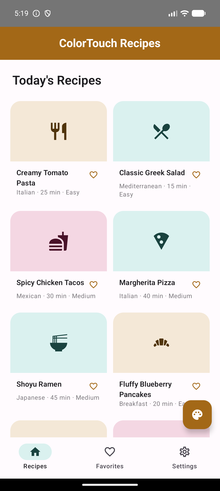
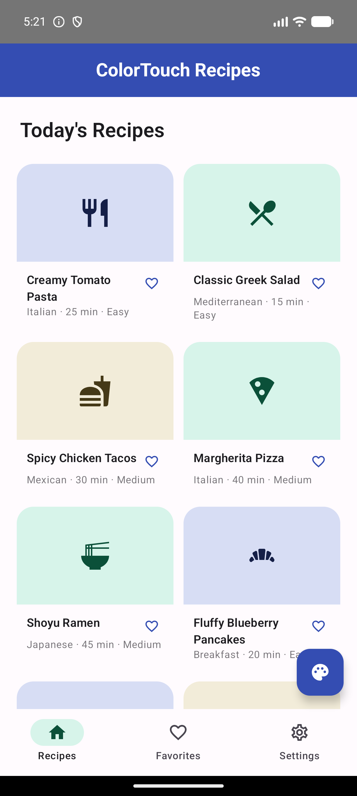

# ColorTouch SDK

**Seminar Project — 10221 Advanced Seminar in Mobile Development**
**Afeka College of Engineering**
**Student:** Hila Hindi

---

## Table of Contents

1. [Project Overview](#1-project-overview)
2. [Screenshots](#2-screenshots)
3. [Architecture](#3-architecture)
4. [Component Breakdown](#4-component-breakdown)
5. [Tech Stack](#5-tech-stack)
6. [Project Structure](#6-project-structure)
7. [Public API](#7-public-api)
8. [Setup & Running Locally](#8-setup--running-locally)
9. [Design Decisions](#9-design-decisions)

---

## 1. Project Overview

An Android library that fetches a Material3 color palette for your app —
personalized per end user from a short in-app questionnaire, generated by an
LLM acting as a color psychologist — plus a demo app showing it in use.

This repo is the Android half of ColorTouch. The backend API and developer
dashboard it talks to live in a separate repo:
[ColorTouch-System](https://github.com/hilahindi/ColorTouch-System), which
also has the full architecture write-up and dashboard screenshot gallery for
the system as a whole.

| Module | Purpose |
|---|---|
| `colortouch-sdk/` | The library: `ColorTouchClient` singleton, networking, caching, Compose `ColorScheme` mapping |
| `sample-app/` | "ColorTouch Recipes" — a working demo app exercising every SDK feature |

---

## 2. Screenshots

The bundled sample app demonstrates the full flow. Every color below is
generated by the SDK — none are hardcoded:

| Default (base palette) | Questionnaire (themed live) | Recipe detail |
|:---:|:---:|:---:|
|  |  |  |

Note how the questionnaire itself is themed with the *current* palette too —
it's wrapped in the same `MaterialTheme` as the rest of the app, not a fixed
default style.

Four genuinely distinct AI-generated personas from the same questionnaire,
driven purely by different answers:

| Morning Momentum | Deep Focus | Creative Spark | Night Owl |
|:---:|:---:|:---:|:---:|
|  |  |  |  |

See the [ColorTouch-System README](https://github.com/hilahindi/ColorTouch-System#2-screenshots--demo)
for the full dashboard + Android screenshot gallery, including the recipe
detail, deep-dive prompt, favorites, and settings screens.

---

## 3. Architecture

```
┌─────────────────────────────────────────────────────────────┐
│                    Your App (Compose UI)                     │
│                                                               │
│   ColorTouchClient.initialize(context, baseUrl)               │
│            │                                                 │
│            ▼                                                 │
│   currentPalette: StateFlow<PaletteResponse?>                 │
│   (restores cached / default palette immediately)              │
│            │                                                 │
│   User answers questionnaire                                  │
│            │                                                 │
│            ▼                                                 │
│   getPersonalizedPalette(developerId, userId, answers)         │
└───────────────────────────┬───────────────────────────────────┘
                            │ Retrofit / OkHttp
                            ▼
                POST /personalized-palette
                            │
                            ▼
                 ColorTouch Server  (separate repo)
                            │
                            ▼
                palette + AI design rationale
                            │
                            ▼
            currentPalette StateFlow emits ──► MaterialTheme(colorScheme = …)
                            │
                            ▼
              PaletteStorage (Jetpack DataStore)
              survives process death, no re-fetch needed
```

---

## 4. Component Breakdown

| File | Responsibility |
|---|---|
| `ColorTouchClient.kt` | Singleton entry point: `initialize`, `getPersonalizedPalette`, `setDefaultPalette`, `startDefaultPalettePolling`, `resetToDefault`; owns the `currentPalette` StateFlow |
| `ColorSchemeMapper.kt` | Maps the wire-format 36-color scheme to a real Compose Material3 `ColorScheme` via `toComposeColorScheme()` |
| `ColorTouchResult.kt` | Sealed result type (`Success` / `ApiError` / `NetworkError`) — every meaningful HTTP status the server returns reaches the caller as data, not a thrown exception |
| `PaletteStorage.kt` | Jetpack DataStore-backed persistence for the last personalized palette, so it survives process death |
| `network/ColorTouchApi.kt` | Retrofit interface: `getPersonalizedPalette`, `getDefaultPalette` |
| `model/PaletteResponse.kt`, `model/Question.kt` | Wire-format data classes shared between the SDK and the server's JSON Schemas |

---

## 5. Tech Stack

| Layer | Technology |
|---|---|
| Language | Kotlin |
| UI | Jetpack Compose, Material3 |
| Networking | Retrofit2 + OkHttp |
| Local persistence | Jetpack DataStore |
| Serialization | kotlinx.serialization |

---

## 6. Project Structure

```
ColorTouch-SDK/
├── colortouch-sdk/                         # The library module
│   └── src/main/kotlin/com/colortouch/sdk/
│       ├── ColorTouchClient.kt              # Public singleton entry point
│       ├── ColorSchemeMapper.kt             # Wire format → Compose ColorScheme
│       ├── ColorTouchResult.kt              # Success / ApiError / NetworkError
│       ├── PaletteStorage.kt                # DataStore-backed persistence
│       ├── model/                           # PaletteResponse, Question, ColorModes
│       └── network/                         # Retrofit API interface
│
├── sample-app/                              # "ColorTouch Recipes" demo app
│   └── src/main/kotlin/com/colortouch/sampleapp/
│       ├── MainActivity.kt                  # App shell, palette-driven MaterialTheme
│       ├── QuestionnaireScreen.kt           # The bundled questionnaire bottom sheet
│       ├── Recipes.kt                       # Sample recipe data + detail screen
│       ├── QuestionsRepository.kt           # Loads the bundled question set asset
│       └── DefaultPalette.kt                # Hardcoded fallback before any fetch succeeds
│
├── docs/screenshots/                        # Screenshots used in this README
└── JITPACK.md                               # Release process + Jitpack coordinates
```

---

## 7. Public API

### Initialization

```kotlin
// Once, e.g. in Application.onCreate() or an Activity
ColorTouchClient.initialize(
    context = this,
    baseUrl = "https://your-colortouch-server.example.com/",
)
```

### Personalization

```kotlin
// After the end user answers your in-app questionnaire
val result = ColorTouchClient.getPersonalizedPalette(
    developerId = "<your onboarded developer id>",
    userId = userId,
    userAnswers = UserAnswers(userId = userId, responses = responses),
)

when (result) {
    is ColorTouchResult.Success -> { /* currentPalette StateFlow already updated */ }
    is ColorTouchResult.ApiError -> { /* result.code: 404 not onboarded, 503 AI unavailable */ }
    is ColorTouchResult.NetworkError -> { /* offline, timeout, etc. */ }
}
```

### Observing the current palette

```kotlin
val currentPalette by ColorTouchClient.currentPalette.collectAsState()
val colorScheme = currentPalette?.colors?.toComposeColorScheme(isSystemInDarkTheme())
    ?: lightColorScheme()

MaterialTheme(colorScheme = colorScheme) { /* your app */ }
```

`currentPalette` is a `StateFlow<PaletteResponse?>` that updates automatically
on a successful fetch, a restored saved palette, or `resetToDefault()` — see
`sample-app/MainActivity.kt` for a complete working example.

### Reset & default palette

```kotlin
ColorTouchClient.setDefaultPalette(bundledFallbackPalette)      // shown before any fetch
ColorTouchClient.startDefaultPalettePolling(developerId)        // picks up dashboard changes live
ColorTouchClient.resetToDefault()                               // clears saved personalization
```

---

## 8. Setup & Running Locally

### Installing via Jitpack

```kotlin
// settings.gradle.kts
dependencyResolutionManagement {
    repositories {
        maven("https://jitpack.io")
    }
}
```

```kotlin
// app/build.gradle.kts
dependencies {
    implementation("com.github.hilahindi:ColorTouch-SDK:v0.1.0")
}
```

See [`JITPACK.md`](JITPACK.md) for the release process and version history.

### Running the Sample App

1. Open this repo in Android Studio.
2. Run the `sample-app` configuration on an emulator or device. It points at
   `http://10.0.2.2:3000/` by default — the Android emulator's alias for the
   host machine's localhost, where a locally-running
   [ColorTouch-System](https://github.com/hilahindi/ColorTouch-System)
   server listens. A physical device needs your machine's real LAN IP
   instead (see `MainActivity.kt`).
3. Onboard an app via the ColorTouch-System portal's **App Configuration**
   page first — the sample app only *fetches* a base palette, it doesn't
   onboard one itself.

---

## 9. Design Decisions

| Decision | Rationale |
|---|---|
| Singleton `object`, not an injectable class | Matches how most consumer-facing Android SDKs (Firebase, Stripe) are shaped: configure once at process start, use from anywhere, no DI graph required. The tradeoff — harder to mock in tests — is called out directly in the code's doc comment. |
| `currentPalette` as a `StateFlow`, not a callback | UI collects it directly (`collectAsState()`) and re-composes automatically on fetch success, restore, or reset — no manual callback wiring per screen. |
| DataStore persists the personalized palette, not the default | The developer's default is supplied fresh by the host app on every launch (same pattern as the bundled question set); only the *personalized* result needs to survive process death, since it came from a network call worth not repeating. |
| `ColorTouchResult` sealed class instead of thrown exceptions | The server's specific HTTP status codes (404 = not onboarded, 503 = AI unavailable) are meaningful to the caller — modeling them as data the caller inspects is more explicit than a generic catch block. |
| Own `CoroutineScope` (`SupervisorJob`), not a borrowed one | `ColorTouchClient` is a process-wide singleton, not scoped to an Activity or a Composable — borrowing a screen's scope would risk work being cancelled out from under it when that screen closes. |
| Polling for default-palette updates, not push | There's no push/websocket channel from the server; a developer regenerating their base colors in the dashboard still shows up in the app without a relaunch, at the cost of a request every few seconds — an acceptable tradeoff for a dev-facing demo, not tuned for production scale. |
| Questionnaire themed with the *current* palette, not a fixed style | The bottom sheet is wrapped in the same `MaterialTheme` the rest of the app uses, computed once at the top of the composable tree and passed down — so asking the personalization question already feels like part of the personalized app, not a generic system dialog. |
